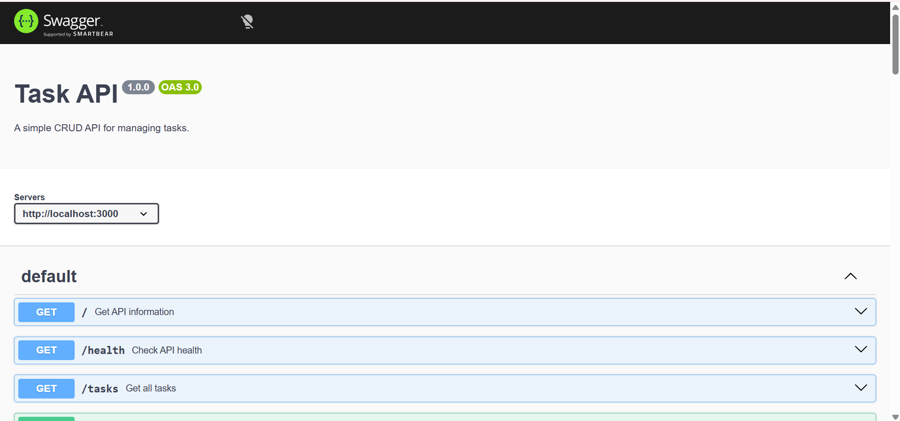

# Task API

A simple RESTful Task API built with Node.js and Express. It supports full CRUD operations and includes interactive API documentation using Swagger UI.

## Features

- Create tasks
- Read all tasks
- Read a single task
- Update tasks
- Delete tasks
- Health check endpoint
- Swagger API documentation

## Tech Stack

- Node.js
- Express.js
- Swagger UI

## Installation

Clone the repository:

```bash
git clone https://github.com/<your-username>/task-api.git
cd task-api
```

Install dependencies:

```bash
npm install
```

Run the server:

```bash
npm run dev
```

The API will be available at:

```
http://localhost:3000
```

Swagger UI:

```
http://localhost:3000/docs
```

---

## API Endpoints

| Method | Endpoint | Description |
|--------|----------|-------------|
| GET | `/` | API information |
| GET | `/health` | Health check |
| GET | `/tasks` | Get all tasks |
| GET | `/tasks/:id` | Get a task by ID |
| POST | `/tasks` | Create a new task |
| PUT | `/tasks/:id` | Update a task |
| DELETE | `/tasks/:id` | Delete a task |

---

## Example `curl`

```bash
curl -i http://localhost:3000/tasks/1
```

Example output:

HTTP/1.1 200 OK
X-Powered-By: Express
Access-Control-Allow-Origin: *
Content-Type: application/json; charset=utf-8
Content-Length: 45
ETag: W/"2d-ZN2ht4P5n4vXUj4HsI1QTp5HANY"
Date: Sun, 19 Jul 2026 23:25:43 GMT
Connection: keep-alive
Keep-Alive: timeout=5

{"id":1,"title":"Learn Express","done":false}

---

## Swagger UI

Open:

```
http://localhost:3000/docs
```

Insert a screenshot here:



---

## Project Structure

```
my-backend/
├── src/
│   └── app.js
├── task-api/
│   └── openapi.json
├── server.js
├── package.json
├── README.md
└── .gitignore
└── images/
│   └── swagger-ui.png
```

## Author

**Maha Zubair**